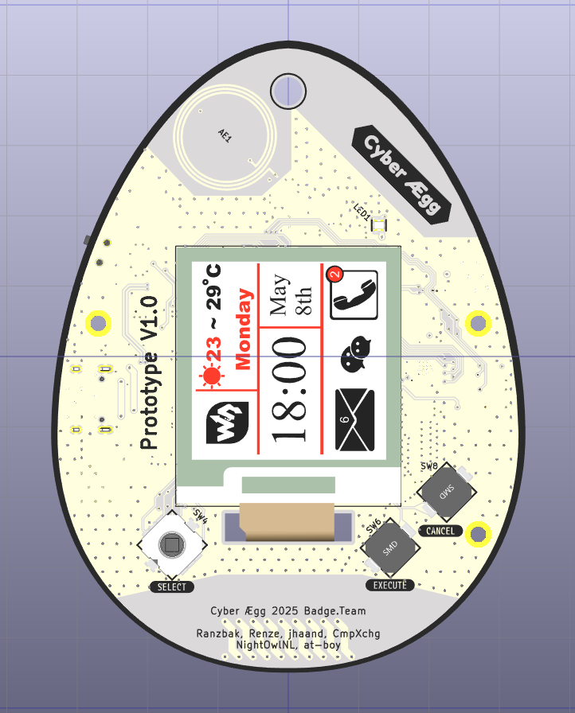
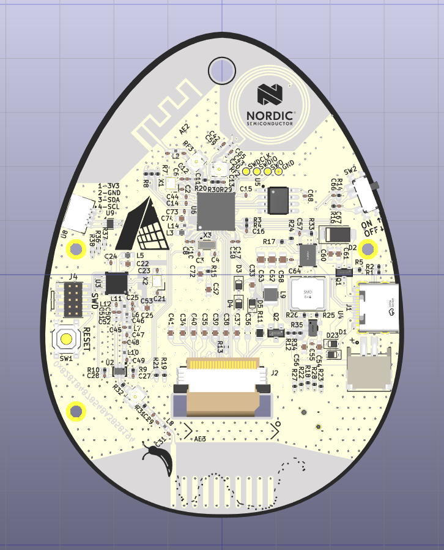

# Cyber Ægg

## Introduction

The badge is intended to be a low power LoRa device, that should be able to at least run for the whole duration of the BornHack camp on one battery charge (One week).
At least that is one of our design goals, lot's of hours chasing down power use in both the hardware and the software are still ahead of us, when measurements have been done I'll share them in the Badge.Team Discord.

At this moment the design is at prototype stage one, and is not fully developed.

For example the NFC, LoRa and Bluetooth circuits still have IPEX connectors integrated to make tuning the circuits easier.

Also certain aspects, especially the on PCB antennas should at least work, but how well, we do not know yet.

Long story short, consider this design BETA, and do not order your own boards yet. (Or if you do, you are on your own.)

## Functionality

The is designed with MeshCore in mind, to connect up to a smart phone using Bluetooth and connect to the greater MeshCore network using the on PCB LoRa circuit.

To provide some extra camp fun, we hope the communication technologies combined with the NFC tag functionality will result in some really cool location based games that will run on the badge.
For now the game ideas being worked out, and it's up to the game team of BornHack what they share.

### Display

For now the e-paper display is designed in from SWI, model number: SG0154BNS800F35HP

The display has a 1.54Inch size with 152x152 pixels.

These displays have the [SSD1680Z8](https://cdn-learn.adafruit.com/assets/assets/000/097/631/original/SSD1680_Datasheet.pdf?1607625960) controller controller IC.

### Manual input

Because the Cyber Ægg badge is inspired by the 90's Tamagotchi egg shaped game, the buttons are named the same.

| button name | function                          |
| ----------- | --------------------------------- |
| Select      | Navigate through the menu options |
| Execute     | Start the option under the cursor |
| Cancel      | Cancel current operation          |

In order to make navigation a more intuitive, the select button has been upgraded to a joystick + button.

### Bluetooth

The Bluetooth implementation on this board is provided by the NRF52840 MCU.
Texas instruments has released a design for a 2.4GHz antenna, the antenna is provided as a Footprint included with Kicad 9.0.

#### BlueTooth Antenna

Bluetooth is using 2.4GHz, and a PCB antenna suitable for this frequency band is integrated into the PCB.
The design used is available in KiCAD 9 in the standard library and is originally by Texas instruments.

The documentation for the antenna can be found here : [swra228.pdf](https://www.ti.com/lit/an/swra228c/swra228c.pdf)

### LoRa

LoRa is provided by a separate SX1262 IC, with a tuning circuit as specified by the data sheet and implementation notes provided by Semtech.

The document that specifies the layout/balun/matching circuit for the sx1262 is named *"AN1200.54"* and can be found at [this page](https://www.semtech.com/products/wireless-rf/lora-connect/sx1261)

#### Lora Antenna

The LoRa antenna is also a Texas instruments design, the specifications can be found here [swra416](https://www.ti.com/lit/an/swra416/swra416.pdf)

### NFC

NRF is again provided by a PHY in the NRF82840 core, which drives a resonant circuit consisting of 2 (eventually) capacitors, and a CPB coil.

The NRF52840 only supports TAG functionality no reader functionality.

The coil in this design has a inductance of around 2.8uH, which together with the capacitors and the paracytics (both capacitance and inductance) should form a tank circuit that matches the 13.56MHz for interacting with an NRC reader.

### QWIIC

The QWIIC port is a standardized connector utilizing I2C, it's included on the badge because many boards have been produced for this [standard](https://www.sparkfun.com/qwiic) setup by Sparkfun.

Pins used for the SDA and SCL pins are listed below.

Two 10k pull up resistors are provided on the board, when the capacitance is too high on the I2C lines, the internal pull-ups can also be enabled (the provide an extra 10k pull-up resistance).

## Pinout

| Ball (aQFN73) | nRF pin      | Pin type(s)              | Project net         | Project function                                         |
| :------------ | :----------- | :----------------------- | :------------------ | :------------------------------------------------------- |
| A12           | P0.02 AIN0   | Digital I/O Analog input | P0.06/BLUE          | LED blue (GPIO output)                                   |
| B13           | P0.03 AIN1   | Digital I/O Analog input | P1.14_LORA_MISO     | LoRa (SX1262) SPI MISO (GPIO input)                      |
| J1            | P0.04 AIN2   | Digital I/O Analog input | P0.04_LORA_RF_SW1   | LoRa RF switch control SW1 (GPIO output)                 |
| L1            | P0.06        | Digital I/O              | BTN_CANCEL          | Button: cancel (GPIO input)                              |
| L24           | P0.07        | Digital I/O              | P0.07_READ_BAT      | Battery read enable: pull low to read VBAT (GPIO output) |
| N1            | P0.08        | Digital I/O              | P0.07_DSP_SCK       | Display (DSP) SPI SCK (GPIO output)                      |
| L24           | P0.09 NFC1   | NFC input                | NFC1                | NFC antenna connection                                   |
| J24           | P0.10 NFC2   | NFC input                | NFC2                | NFC antenna connection                                   |
| U1            | P0.11        | Digital I/O              | P0.11_DSP_BUSY      | Display busy/IRQ (GPIO input)                            |
| V23           | P0.12        | Digital I/O              | P0.12_DSP_RESET     | Display reset (GPIO output)                              |
| AC11          | P0.17        | Digital I/O              | P0.17_PS_SYNC       | PS_SYNC (GPIO, sync/control)                             |
| G1            | P0.26        | Digital I/O              | P0.26_BTN_EXECUTE   | Button: execute (GPIO input)                             |
| H2            | P0.27        | Digital I/O              | P0.27_DSP_MOSI      | Display (DSP) SPI MOSI (GPIO output)                     |
| B11           | P0.28 AIN4   | Digital I/O Analog input | P0.28_LORA_BUSY     | LoRa (SX1262) BUSY (GPIO input)                          |
| A10           | P0.29 AIN5   | Digital I/O Analog input | P0.29_LORA_DIO1     | LoRa (SX1262) DIO1 IRQ (GPIO input)                      |
| B9            | P0.30 AIN6   | Digital I/O Analog input | P0.30_LORA_RST      | LoRa (SX1262) reset (GPIO output)                        |
| A8            | P0.31 AIN7   | Digital I/O Analog input | P0.31/VBAT          | Battery voltage sense (ADC input)                        |
| Y23           | P1.01        | Digital I/O              | P1.01_BTN_JOY_RIGHT | Joystick button: right (GPIO input)                      |
| W24           | P1.02        | Digital I/O              | P1.02_BTN_JOY_FIRE  | Joystick button: fire (GPIO input)                       |
| V23           | P1.03        | Digital I/O              | P1.03_BTN_JOY_DOWN  | Joystick button: down (GPIO input)                       |
| U24           | P1.04        | Digital I/O              | P1.04_BTN_JOY_UP    | Joystick button: up (GPIO input)                         |
| T23           | P1.05        | Digital I/O              | P1.05_BTN_JOY_LEFT  | Joystick button: left (GPIO input)                       |
| P23           | P1.07        | Digital I/O              | P1.07/RED           | LED red (GPIO output)                                    |
| P2            | P1.08        | Digital I/O              | P1.08_CHRG          | Charge status: low when charging (GPIO input)            |
| R1            | P1.09        | Digital I/O              | P1.09_DSP_CSN       | Display (DSP) SPI CSN (GPIO output)                      |
| A20           | P1.10        | Digital I/O              | P1.10_QWIIC_SDA     | Qwiic I²C SDA (open-drain)                               |
| B19           | P1.11        | Digital I/O              | P1.11_QWIIC_SCL     | Qwiic I²C SCL (open-drain)                               |
| B17           | P1.12        | Digital I/O              | P1.12_LORA_SPI_NSS  | LoRa (SX1262) SPI NSS/CS (GPIO output)                   |
| A16           | P1.13        | Digital I/O              | P1.13_LORA_SCK      | LoRa (SX1262) SPI SCK (GPIO output)                      |
| B15           | P1.14        | Digital I/O              | P1.14_LORA_MOSI     | LoRa (SX1262) SPI MOSI (GPIO output)                     |
| A14           | P1.15        | Digital I/O              | P1.15/GREEN         | LED green (GPIO output)                                  |
| AC13          | P0.18 nRESET | Digital I/O              | MCU_RESET           | nRESET (active low)                                      |
| AD6           | D+           | USB                      | USB_D+              | USB data +                                               |
| AD4           | D-           | USB                      | USB_D-              | USB data -                                               |
